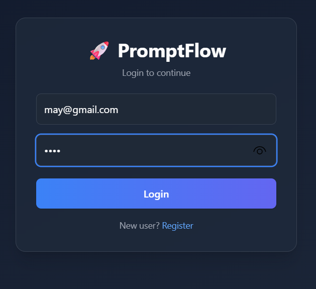
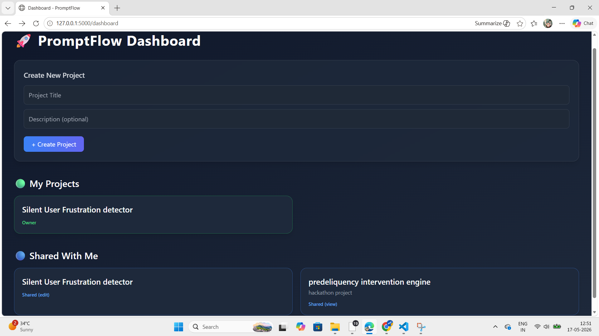
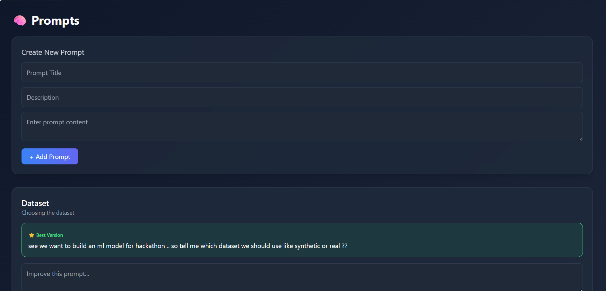
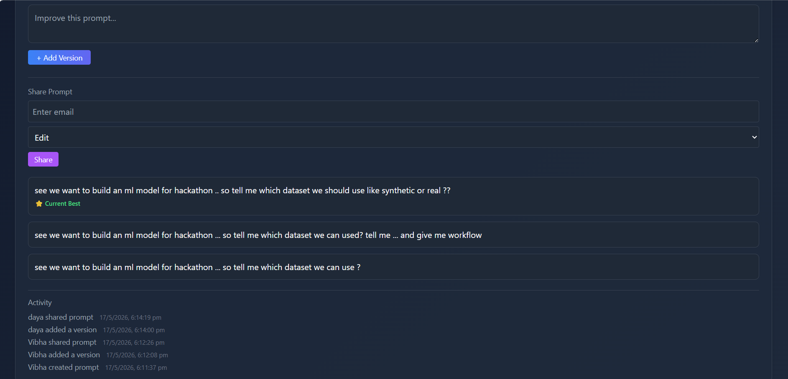

# 🚀 PromptFlow

### Build • Version • Collaborate • Improve

A **DBMS-driven full-stack application** designed to manage prompts with **version control, structured collaboration, and complete activity tracking**.

---

## 🌟 Overview

In real-world systems, content evolves through **iterations, contributors, and decisions**.

**PromptFlow** brings structure to that chaos by combining:

* 📌 Version control for prompts
* 🤝 Controlled collaboration
* 📊 Transparent activity tracking

All powered by a **well-designed relational database (3NF)**.

---

## 🎯 Key Features

### 🧠 Prompt Version Control

* Maintain **multiple versions** of a prompt
* Track:

  * Version number
  * Contributor
  * Content history

```sql
ORDER BY is_best DESC, version_number DESC;
```

---

### ⭐ Best Version System

* Latest version is automatically marked as **best**
* Ensures:

  * ✅ No conflicts
  * ✅ Clean UI/UX
  * ✅ Single source of truth

---

### 🤝 Collaboration System

* Share prompts via **email-based access**
* Role-based permissions:

  * 👀 View
  * ✏️ Edit
* Supports **multi-user contribution workflow**

---

### 📊 Activity Tracking (Audit Trail)

Tracks all major system actions:

* CREATE_PROMPT
* ADD_VERSION
* SHARE_PROMPT

Each log includes:

* Username
* Action
* Timestamp

---

### 🗂️ Project Management

* Organize prompts under projects
* Clean grouping and navigation

---

## 🗄️ Database Design (Core Strength 💡)

### 🔹 Entities

* Users
* Projects
* Prompts
* Versions
* Shares
* Activity

---

### 🔹 Relationships

| Type  | Relationship                 |
| ----- | ---------------------------- |
| 1 : M | Users → Projects             |
| 1 : M | Projects → Prompts           |
| 1 : M | Prompts → Versions           |
| M : M | Users ↔ Prompts (via Shares) |

---

### 🔹 Normalization

* Designed up to **3NF**
* Eliminates redundancy
* Ensures data consistency

---

### 🔹 Constraints

* PRIMARY KEY
* FOREIGN KEY
* NOT NULL
* ENUM (permissions)

---

## ⚙️ Tech Stack

| Layer    | Technology                     |
| -------- | ------------------------------ |
| Backend  | Python (Flask)                 |
| Database | MySQL                          |
| Frontend | HTML, Tailwind CSS, JavaScript |

---

## 🔄 System Workflow

1. User logs in
2. Creates a project
3. Adds a prompt
4. Creates multiple versions
5. Latest version becomes **best**
6. Shares prompt with collaborators
7. Contributors edit & improve
8. All actions are logged

---

## 📸 Demo

<p align="center">
  <a href="https://drive.google.com/file/d/1vwkrd3eo2GaR6w66qq_pup2_Zu1PYlQF/view?usp=sharing">
    
  </a>
</p>

📷 Screenshots
<p align="center">  </p> <p align="center">  </p> <p align="center">  </p> <p align="center">  </p> <p align="center">  </p>
---

## ⚡ Sample Queries

```sql
-- Get versions (best first)
SELECT * FROM Versions
WHERE prompt_id = ?
ORDER BY is_best DESC, version_number DESC;
```

```sql
-- Get shared projects
SELECT DISTINCT p.project_id, p.title
FROM Shares s
JOIN Prompts pr ON s.prompt_id = pr.prompt_id
JOIN Projects p ON pr.project_id = p.project_id;
```

---

## 🚀 Getting Started

```bash
git clone https://github.com/YOUR_USERNAME/PromptFlow.git
cd PromptFlow

pip install -r requirements.txt
python app.py
```

Open in browser:

```
http://127.0.0.1:5000
```

---

## 🧠 What I Learned

* Designing **normalized relational schemas (3NF)**
* Handling **real-world relationships (1:M, M:M)**
* Implementing **version control logic at DB level**
* Maintaining **data integrity using constraints**
* Building a **DB-centric full-stack system**

---

## 🚀 Future Improvements

* 🔍 Advanced search & filtering
* ⚡ Indexing for performance optimization
* 🧠 AI-based prompt suggestions
* 🔄 Real-time collaboration
* ⚙️ Stored procedures & triggers


**Mrunal Khadke**
Engineering Student | DBMS & Backend Enthusiast
